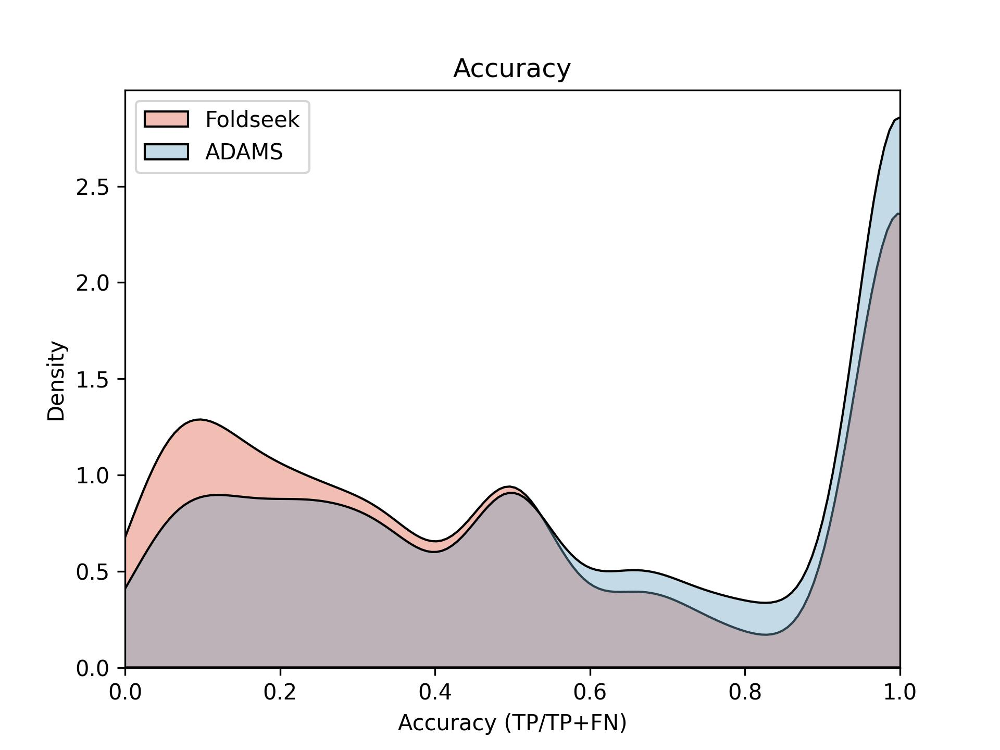

# ADAMS: Align Distance Matrix with SIFT algorithm enables GPU-Accelerated protein structre comparison

## Requirements

opencv == 4.7.0.72

numpy >= 1.17.2

cuda > 11.x

cupy-cuda111 == 12.2.0 or same as cuda version

biopython == 1.81

scipy == 1.11.2

tqdm == 4.66.1

cuda == 11.x or same as cupy version

pickle

## Installation

A pypi package coming soon. Python source code is available above

## Tutorial and description

### Introduction

We've developed a technique to address the issue of numerous proteins 
exhibiting high structural similarity despite having no sequence 
similarities. This problem has become increasingly critical as 
Alphafold2 continues to predict new structures, resulting in a massive 
database (23TiB ver 4) that lacks an effective data mining tool.

Foldseek offers a solution by embedding local structure into the 
sequence and transforming this issue into a sequence alignment problem. 
It's significantly faster than DALI, TM-Align, and CE-Align and 
outperforms them on structure comparison benchmarks.

However, according to the Foldseek paper, we observed that Foldseek occasionally underperforms 
compared to DALI, indicating that some 'overall information' 
may not be captured within local structure embedding.

Our Align Distance Matrix with SIFT algorithm (ADAMS) is 
similar to DALI but uses an enhanced version of the renowned 
computer vision algorithm - Scale Invariant Feature Transform (SIFT). 
It extracts key features from protein distance matrices at different 
scales and compares their similarities. Most calculations can benefit 
from GPU acceleration. This zero-shot model enables more precise 
structure comparisons at speeds comparable to Foldseek-TM tools. 
Users can create their own pdb databases on PCs for all-vs-all 
comparisons with increased speed and reduced memory usage 
(approximately 500MB - 3GB GPU memory for a 20000 all vs all comparison).

The algorithm is illustrated in Fig.1: The original SIFT algorithm is 
applied on distance matrixes to extract detectable features across 
various scales. These features are represented as 128-dimension vectors 
which are then stacked into an n X 128 matrix for comparison between 
two structures using cosine similarity calculated between two feature 
matrices by A X B.T operation. Given these features have nearly identical
lengths (512 ± 1.5), feature distances are determined by angles rather 
than length differences between them; thus when normalized beforehand, 
similarity calculation becomes straightforward on GPUs.

The performance metrics are as follows - it took between 8-10 seconds 
to search for the protein structure 'OSM-3' (699aa) within a C.elegans protein 
structure database using an Nvidia RTX2080Ti (11GiB) GPU. When loading 
the entire database onto the dataset, total GPU memory usage was around
4000MB. However, when loaded separately, it only consumed about 500MB 
of memory. Importantly, these different methods did not impact search 
speed. 

Figure 2 presents the accuracy results from a comprehensive comparison 
within the SCOPe40 dataset. Accuracy is calculated as (TP/TP+FN), 
where TP (True Positive) refers to hits within the same superfamily 
according to SCOP classification until the first FP -- hits to another 
fold.

Our model significantly outperformed at both ends of the accuracy 
spectrum. ADAMS was able to identify more correct structural correlations
that Foldseek struggled with. Additionally, in areas of both 100% and 0% accuracy, 
there was a noticeable disparity between Foldseek and ADAMS.

We tested the local version of Foldseek and found it to be ultra-fast 
with acceptable accuracy especially when it performed an all vs all structure clustering, as stated in their paper.
Actually, it is so impressive that we almost want to give up our model.
However, for high-accuracy protein structure searches at nearly the same speed, 
ADAMS performs better.

### Tutorial
#### Make your own database
##### 1. Download a pdb set and make it a cuda_database or a compatible one
coming soon
##### 2. Match your protein structure
coming soon

It's 11:30 pm and I am still working!!!!!!!
